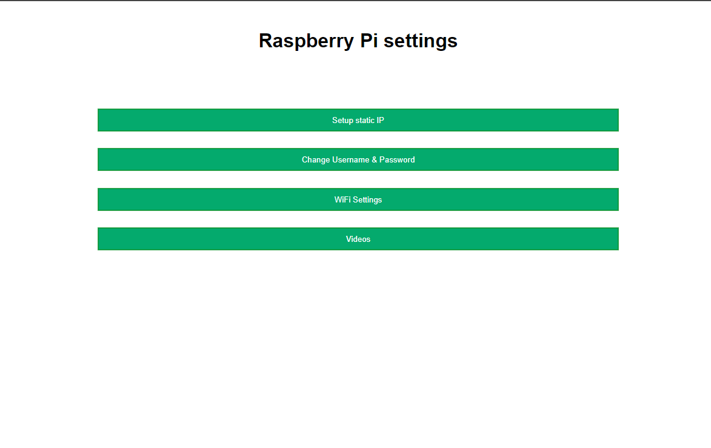
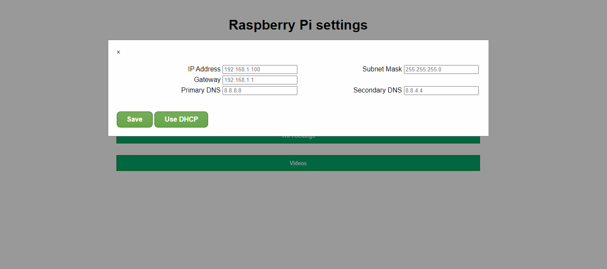
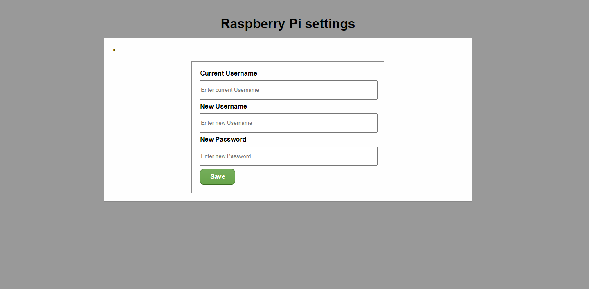
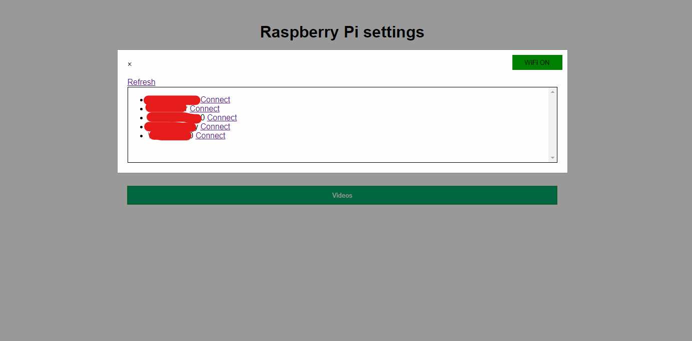

# raspi-config-web-interface

This app is developed to be used on Raspberry Pi for controlling basic settings from the browser like connecting to some WiFi network, setting up static IP address, changing username/password etc.

## How to use 
1. Login to the Pi as root user
2. Clone this repository using this command
```
git clone https://github.com/iZeeshanDhillon/raspi-config-web-interface.git
```
3. Change directory to the project directory with this command
```
cd raspi-config-web-interface
```
4. Run these commands to install dependencies 
```
wget -O - https://raw.githubusercontent.com/meech-ward/NodeJs-Raspberry-Pi/master/Install-Node.sh | sudo bash;
echo "alias node=/opt/nodejs/bin/node" >> ~/.bashrc && source ~/.bashrc
npm install http-server -g
npm install express --save
```
5. Use one of these commands to run the app

```
node app.js
```
OR
```
/opt/nodejs/bin/node app.js
```

Here is the screenshot of the UI

#### Home


#### Set static or DHCP IP


#### Set static or DHCP IP


#### Set static or DHCP IP
 